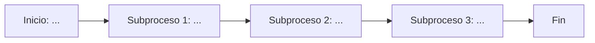

# Diagrama del proceso actual

Macroproceso: [nombre del proceso] — subprocesos clave: [subproceso 1], [subproceso 2], [subproceso 3].

## Descripción de cada subproceso
- **[Subproceso 1]:** [qué ocurre, quién participa]
- **[Subproceso 2]:** [qué ocurre, quién participa]
- **[Subproceso 3]:** [qué ocurre, quién participa]