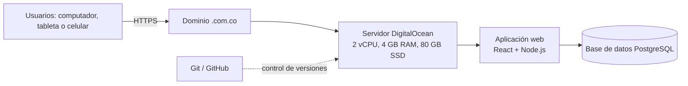

# Estimación de costos

## Ficha técnica de hardware e infraestructura
| Componente | Especificación | Cantidad | Costo unitario | Costo total |

| Dominio | Registro anual `.com.co` | 1 año | $61.900 | $61.900 |
| Servidor / hosting DigitalOcean | 2 vCPU, 4 GB de RAM y 80 GB SSD | 3 meses | $75.026 / mes | $225.078 |
| **Total de infraestructura** |  |  |  | **$286.978** |

## Ficha técnica de software
| Software o servicio | Tipo de licencia | Costo |
|---|---|---:|
| SSL | Certificado HTTPS sin costo | $0 |
| PostgreSQL | Software libre y de código abierto | $0 |
| Node.js | Software libre y de código abierto | $0 |
| React | Software libre y de código abierto | $0 |
| Git / GitHub | Herramienta de control de versiones; plan utilizado sin costo | $0 |
| **Total de software** |  | **$0** |

## Arquitectura de red
La solución será una aplicación web accesible desde computadores, tabletas y celulares mediante Internet. Los usuarios se conectarán utilizando HTTPS y un dominio `.com.co`. El servidor de DigitalOcean alojará la aplicación desarrollada con Node.js y React, mientras que PostgreSQL almacenará la información del sistema. Git y GitHub se utilizarán para administrar el código fuente. Se contemplan autenticación, control de acceso por roles, validación de datos y copias de seguridad periódicas.

## Comparativo de proveedores
| Proveedor | Producto/Servicio | Precio | Ventajas | Desventajas |
|---|---|---:|---|---|
| DigitalOcean | Servidor de 2 vCPU, 4 GB RAM y 80 GB SSD | USD 24/mes; aprox. $75.026 COP | Recursos suficientes para el alcance inicial, precio transparente, fácil administración y posibilidad de ampliar capacidad | Requiere configuración y administración técnica |
| AWS Lightsail | Configuración equivalente | USD 24/mes; aprox. $75.026 COP | Escalable y con integración con el ecosistema AWS | Mayor complejidad de configuración |
| Hostinger | 4 CPU, 4 GB RAM y 100 GB NVMe | Promoción $25.900/mes; renovación aprox. $84.900/mes | Buen almacenamiento y precio promocional inicial | El precio depende del periodo contratado y aumenta en la renovación |
| Dominio.com | Dominio `.com` por un año | $61.900 | Permite publicar la aplicación con una dirección propia | Es un costo anual que debe renovarse |

**Elección final:** DigitalOcean para el servidor y un dominio `.com.co` para publicar la aplicación. PostgreSQL se mantiene como la tecnología de base de datos definida para el proyecto.

## Estudio de recurso humano
| Integrante | Rol | Dedicación | Modalidad | Costo estimado |
|---|---|---:|---|---:|
| Tomás | Líder de proyecto y desarrollador | 240 horas a $25.000/hora | Honorarios por hora | $6.000.000 |
| Jhana | Analista de requisitos y desarrolladora | 300 horas a $20.000/hora | Honorarios por hora | $6.000.000 |
| Juan | Desarrollador Full Stack | 360 horas a $18.000/hora | Honorarios por hora | $6.480.000 |
| Jorge | Desarrollador Backend | 360 horas a $18.000/hora | Honorarios por hora | $6.480.000 |
| Samuel | Desarrollador Frontend y QA | 360 horas a $18.000/hora | Honorarios por hora | $6.480.000 |
| **Total** |  | **1.620 horas** |  | **$31.440.000** |

Los valores se estiman por horas de trabajo y corresponden a un proyecto académico bajo la modalidad de honorarios, no a una nómina permanente.

## Costo total estimado del proyecto
| Concepto | Valor |
|---|---:|
| Infraestructura | $286.978 |
| Software | $0 |
| Recursos humanos | $31.440.000 |
| **Subtotal** | **$31.726.978** |
| Contingencia del 10% | $3.172.698 |
| **Total exacto con contingencia** | **$34.899.676** |
| **Total comercial redondeado** | **$34.900.000** |

El total comercial redondeado coincide con el valor presentado en el resumen ejecutivo del Excel.